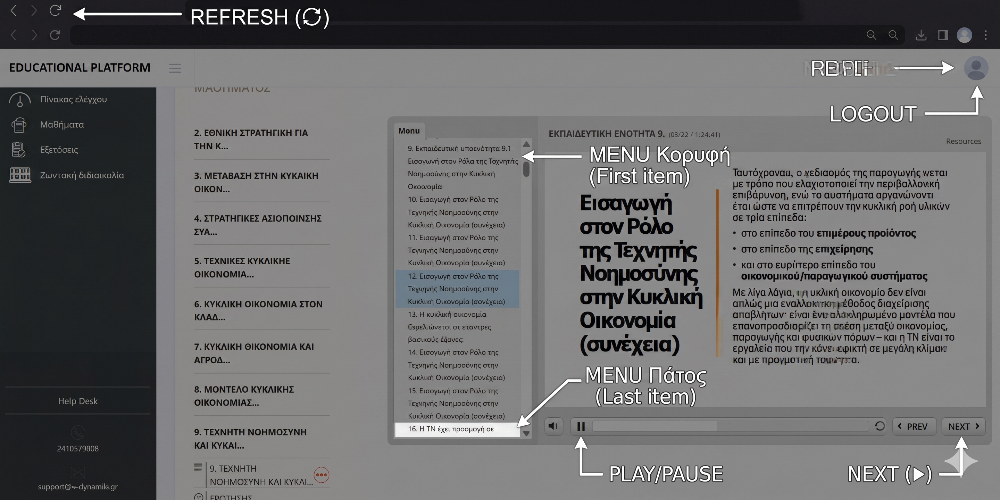

# 🖱️ Mouse Mover - Αυτόματος Βοηθός E-Learning

Πρόγραμμα που προσομοιώνει ανθρώπινη δραστηριότητα σε πλατφόρμες e-learning.

---

## ⚡ Γρήγορη Εκκίνηση με EXE (Συνιστάται — χωρίς εγκατάσταση)

### 1. Κατέβασε το πρόγραμμα
- Πάτα το πράσινο κουμπί **"<> Code"** πάνω δεξιά
- Επίλεξε **"Download ZIP"**
- Αποσυμπίεσε το ZIP
- Μπες στον φάκελο **`MouseMoverV3`**
- Τρέξε το **`MouseMoverV3.exe`** με διπλό κλικ

### 2. Πρώτη ρύθμιση
| Βήμα | Τι κάνεις |
|------|-----------|
| 1 | Άνοιξε την πλατφόρμα e-learning στον browser |
| 2 | Άνοιξε το `MouseMoverV3.exe` |
| 3 | Πάτα **⚙ Ρυθμίσεις Συντεταγμένων** |
| 4 | Για κάθε σημείο πάτα **🎯 Καταγραφή** και βάλε το ποντίκι εκεί μέσα σε 5 δευτερόλεπτα |
| 5 | Πάτα **💾 Αποθήκευση** |
| 6 | Δοκίμασε με τα κουμπιά **Test** (Next, Λίστα, Refresh, Logout) |
| 7 | Βάλε τις ώρες shutdown και πάτα **START** |

> ⚠️ Το `MouseMoverV3.exe` και το `mover_config.json` πρέπει να είναι στον **ίδιο φάκελο**!

---

## 📦 Εκδόσεις

| Έκδοση | Αρχείο | Περιγραφή |
|--------|--------|-----------|
| **V3** ⭐ | `MouseMoverV3.exe` | Νέα έκδοση με Bezier κίνηση & Anti-Bot |
| Pro | `mouse_mover_pro.py` | Σταθερή έκδοση (χρειάζεται Python) |
| V3 Script | `mouse_mover_v3.py` | V3 για προχωρημένους (χρειάζεται Python) |

---

## 🐍 Εγκατάσταση με Python (για προχωρημένους)

### 1. Εγκατάσταση Python
- Κατέβασε από το [python.org/downloads](https://python.org/downloads)
- **Σημαντικό:** Τσέκαρε το **"Add Python to PATH"** κατά την εγκατάσταση

### 2. Εγκατάσταση βιβλιοθηκών
```
pip install pyautogui keyboard
```

### 3. Εκκίνηση
```
python mouse_mover_v3.py
```

---

## ⚙️ Σημεία που χρειάζονται ρύθμιση



| Σημείο | Περιγραφή |
|--------|-----------|
| MENU Κορυφή | Πρώτη καρτέλα της λίστας μαθημάτων |
| MENU Πάτος | Τελευταία καρτέλα της λίστας |
| NEXT | Κουμπί "NEXT ▶" κάτω δεξιά |
| PLAY/PAUSE | Κουμπί ▶/⏸ κάτω στον player |
| REFRESH | Κουμπί ⟳ πάνω αριστερά στον browser |
| PROFILE | Εικονίδιο χρήστη πάνω δεξιά |
| LOGOUT | Εμφανίζεται μετά κλικ στο Profile |

---

## 🎮 Πλήκτρα

| Πλήκτρο | Λειτουργία |
|---------|-----------|
| F9 | Άμεσο κλικ NEXT |
| F8 | Άμεση δραστηριότητα λίστας |
| F7 | Άμεσο Refresh |
| Ποντίκι στη γωνία | Άμεσο σταμάτημα |

---

## ✨ Χαρακτηριστικά V3

- **Bezier κίνηση** — φυσική καμπύλη τροχιά αντί ευθείας γραμμής
- **Anti-Bot** — τυχαίες ταχύτητες και μικρο-κινήσεις
- **Auto Refresh** — ανανεώνει κάθε 45-55 λεπτά για να μην κλείσει το session
- **Auto Logout** — αποσύνδεση 3 λεπτά πριν το shutdown
- **Auto Shutdown** — κλείνει τον υπολογιστή μετά από X ώρες
- **Αποθήκευση ρυθμίσεων** — θυμάται τις συντεταγμένες

---

## ⚠️ Σημειώσεις

- Αν αλλάξεις zoom στον browser, πρέπει να ξαναρυθμίσεις τις συντεταγμένες
- Για 2η οθόνη οι συντεταγμένες είναι διαφορετικές
- Το πρόγραμμα πρέπει να τρέχει με την πλατφόρμα ανοιχτή

---

## 📋 Αποποίηση Ευθύνης

Το εργαλείο αυτό προορίζεται για εκπαιδευτικούς σκοπούς και αυτοματισμό γενικής χρήσης. Ο χρήστης είναι υπεύθυνος για τη συμμόρφωση με τους όρους χρήσης κάθε πλατφόρμας. Οι δημιουργοί δεν φέρουν καμία ευθύνη για τυχόν παραβίαση όρων χρήσης τρίτων υπηρεσιών.
